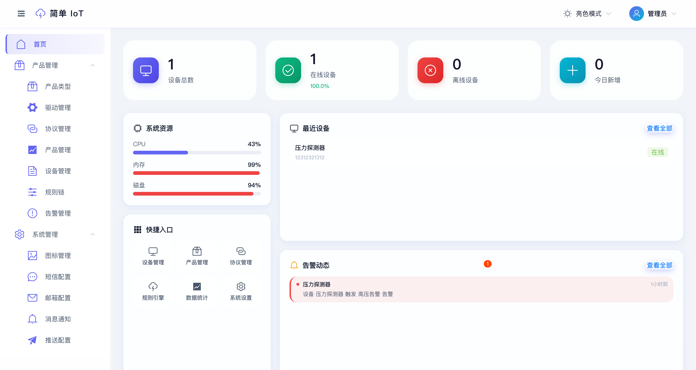
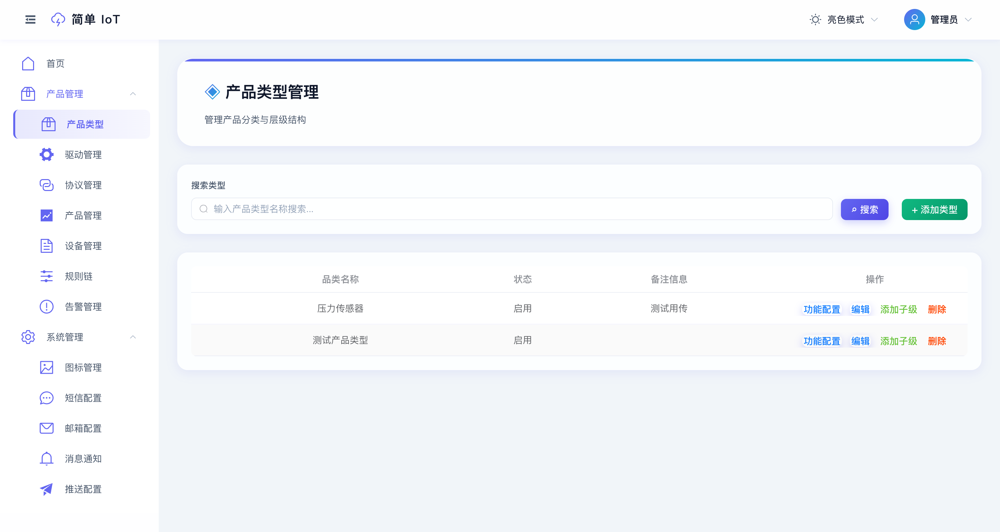
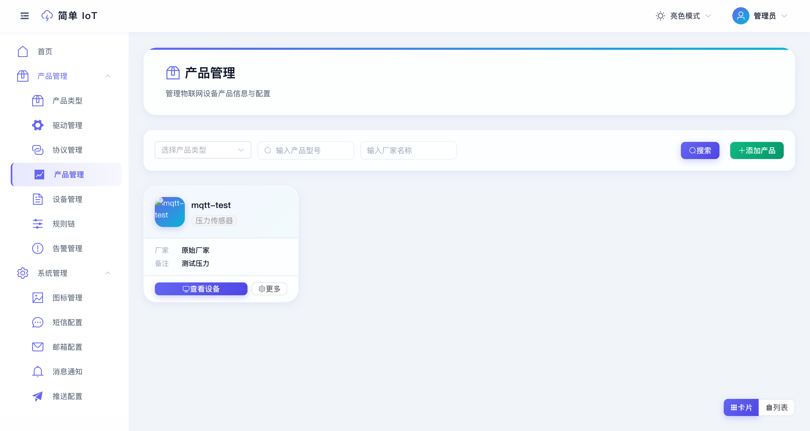
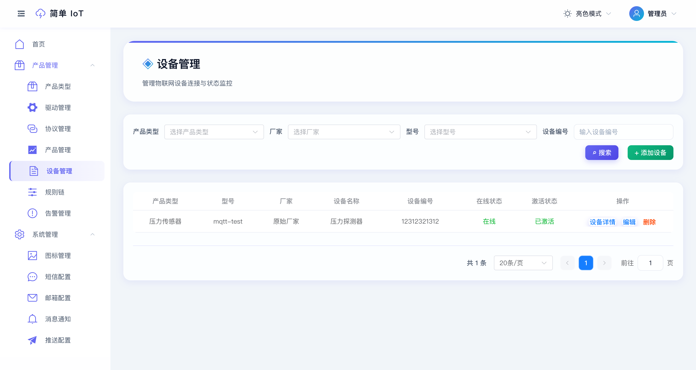
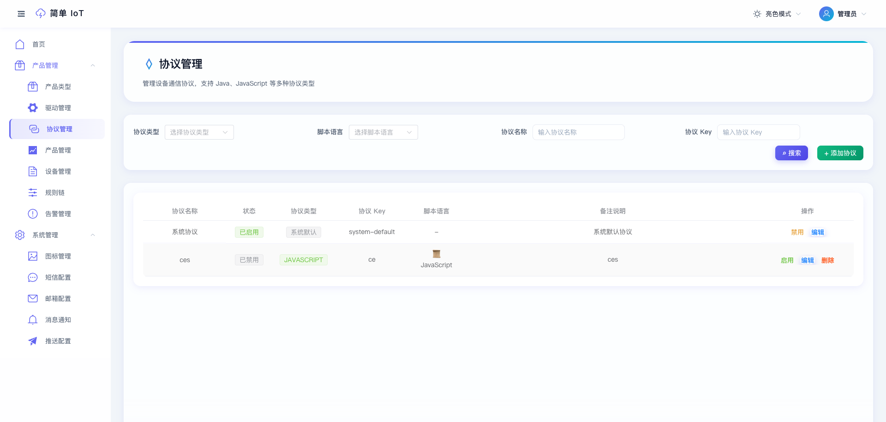
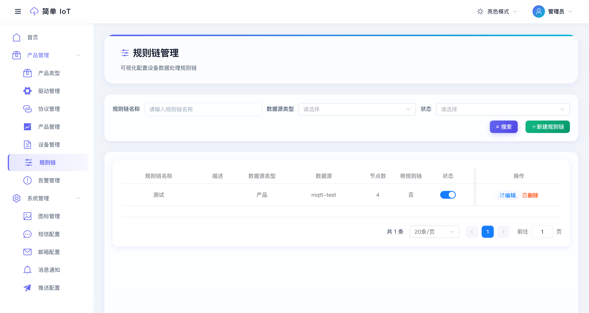
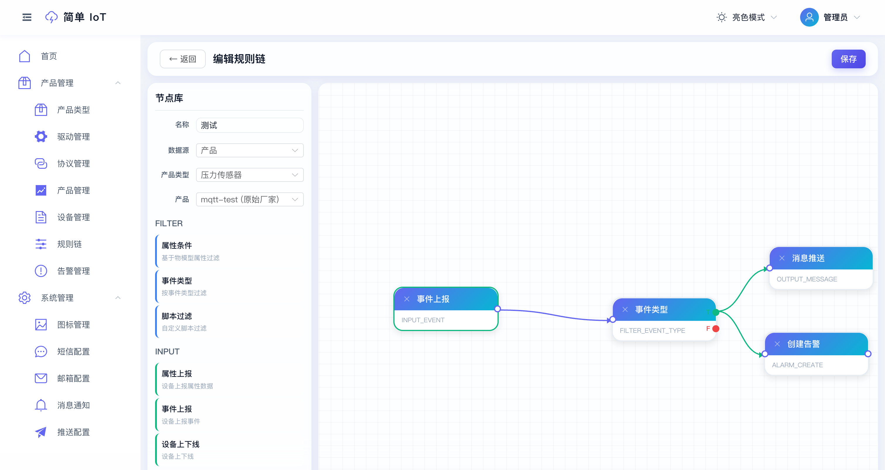
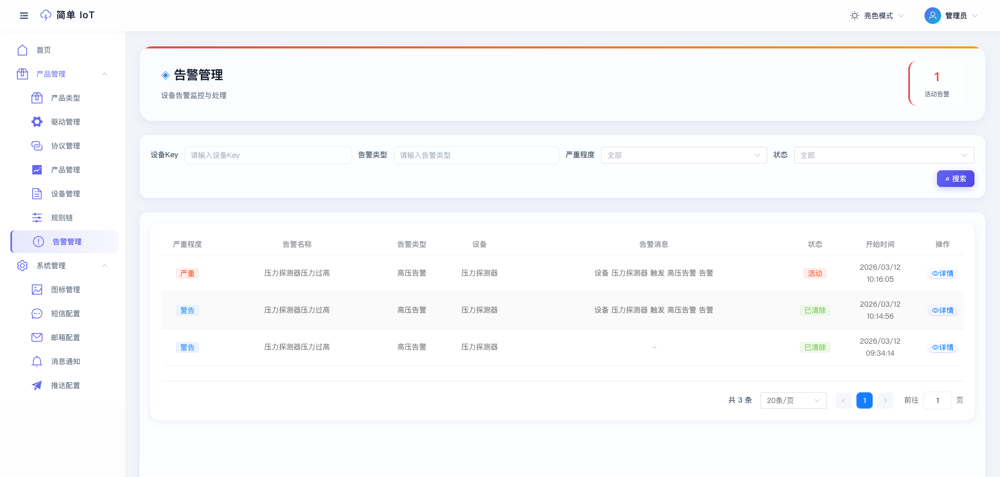

# Simple IoT Platform

<p align="center">
  
  
  
  
</p>

<p align="center">
  <b>轻量级 · 易部署 · 高性能</b>
</p>

<p align="center">
  一款面向中小企业的轻量级物联网管理平台，采用单体架构设计，<br>
  聚焦核心功能，降低分布式复杂度，开箱即用。
</p>

---

## 在线体验

- **演示地址**：http://122.51.129.91
- **体验账号**：`admin` / `123456`

---

## 核心亮点

### 现代化技术栈
- **后端**：Java 25 + Spring Boot 4.0.2，拥抱最新技术
- **前端**：Vue 3 + Vite + Element Plus，极速开发体验
- **数据库**：PostgreSQL + InfluxDB 3，业务数据与时序数据分离

### 精美的 UI 设计
- **玻璃态设计** (Glassmorphism)，现代感十足
- **暗色/亮色主题** 自动切换，护眼舒适
- **响应式布局**，完美适配各种屏幕尺寸

### 灵活的协议支持
- 内置 **MQTT Broker**，无需额外部署
- 支持 **Java / JavaScript / Groovy / Lua** 脚本协议
- 动态协议加载，无需重启服务

### 高效的数据处理
- **时序数据库** InfluxDB 3，高效存储设备遥测数据
- **本地缓存** Caffeine，降低数据库压力
- **细粒度权限** Sa-Token，安全可控

---

## 功能模块

| 模块 | 功能描述 |
|------|----------|
| **设备管理** | 设备注册、在线状态监控、批量操作 |
| **产品管理** | 产品类型定义、物模型配置、产品图标 |
| **协议管理** | 多语言协议脚本、动态加载、启用/禁用 |
| **规则引擎** | 可视化规则链编辑器、多类型输入/过滤/输出节点、告警管理 |
| **数据监控** | 实时数据展示、历史数据查询 |
| **系统设置** | 用户管理、权限配置、系统参数 |

---

## 技术架构

### 后端技术

| 组件 | 版本 | 说明 |
|------|------|------|
| Spring Boot | 4.0.2 | 核心框架 |
| Java | 25 | 运行时环境 |
| Sa-Token | - | 认证鉴权 |
| MyBatis-Plus | - | ORM 框架 |
| PostgreSQL | - | 业务数据库 |
| InfluxDB | 3.0 | 时序数据库 |
| Caffeine | - | 本地缓存 |
| mica-mqtt | - | MQTT Broker |
| Hutool | - | 工具库 |

### 前端技术

| 组件 | 版本 | 说明 |
|------|------|------|
| Vue | 3.x | 渐进式框架 |
| Vite | - | 构建工具 |
| Element Plus | - | UI 组件库 |
| Pinia | - | 状态管理 |
| Vue Router | - | 路由管理 |
| Axios | - | HTTP 客户端 |

---

## 快速开始

### 环境要求

- JDK 25+
- Node.js 18+
- PostgreSQL 14+
- InfluxDB 3.0 (可选)

### 后端启动

```bash
# 克隆项目
git clone https://github.com/dingdaoyi/simple-iot.git
cd simple-iot

# 配置数据库 (修改 application.yml)
# 创建 PostgreSQL 数据库

# 启动后端服务
cd iot-server
mvn spring-boot:run
```

### 前端启动

```bash
# 安装依赖
cd iot-web
pnpm install

# 启动开发服务器
pnpm dev
```

### 访问系统

- 前端地址：http://localhost:5173
- API 文档：http://localhost:8080/doc.html
- 默认账号：`admin` / `123456`

---

## 项目结构

```
sample-iot/
├── iot-server/                 # 后端服务
│   ├── src/main/java/
│   │   └── com/github/dingdaoyi/
│   │       ├── config/         # 配置类
│   │       ├── controller/     # 控制器
│   │       ├── service/        # 业务逻辑
│   │       ├── mapper/         # 数据访问
│   │       ├── entity/         # 实体类
│   │       └── model/          # 数据模型
│   └── src/main/resources/
│       ├── mapper/             # MyBatis XML
│       └── application.yml     # 配置文件
│
├── iot-web/                    # 前端项目
│   ├── src/
│   │   ├── api/                # API 接口
│   │   ├── components/         # 公共组件
│   │   ├── composables/        # 组合式函数
│   │   ├── layout/             # 布局组件
│   │   ├── router/             # 路由配置
│   │   ├── store/              # 状态管理
│   │   ├── styles/             # 全局样式
│   │   └── views/              # 页面组件
│   └── vite.config.mjs         # Vite 配置
│
├── iot-protocol-core/          # 协议核心模块
└── iot-common/                 # 公共模块
```

---

## 界面预览

### 首页仪表盘



- 设备概览统计（总数、在线、离线、今日新增）
- 系统资源监控（CPU、内存、磁盘）
- 最近设备列表
- 告警动态通知

### 产品类型管理



- 树形结构展示产品分类
- 支持多级嵌套

### 产品管理



- 卡片视图 / 列表视图切换
- 产品图标自定义上传
- 快速跳转设备列表

### 设备管理



- 设备状态实时监控
- 物模型数据展示
- 在线/离线状态管理

### 协议管理



- 多语言脚本支持（Java / JavaScript / Groovy / Lua）
- 动态协议加载
- 一键启用/禁用

### 规则引擎





- **可视化编辑器**：拖拽式节点编排，实时预览连接关系
- **输入节点**：属性上报、事件上报、设备上下线监听
- **过滤节点**：属性条件过滤、事件类型过滤、脚本过滤（JavaScript）
- **输出节点**：消息推送（邮件/短信）、HTTP 回调、MQTT 转发、设备指令
- **告警节点**：创建告警、清除告警，支持多级严重程度
- **模板变量**：支持 `${deviceName}`, `${eventTime}`, `${属性标识符}` 等变量替换

### 告警管理



- 设备告警实时监控
- 多级严重程度（提示/警告/严重/紧急）
- 告警状态管理（活动/已清除）

---

## 部署指南

### Docker 部署（推荐）

```bash
# 1. 赋予脚本执行权限
chmod +x deploy.sh

# 2. 一键部署
./deploy.sh deploy
```

详细部署说明请查看 [Docker 部署文档](doc/deploy.md)

### 部署命令速查

| 命令 | 说明 |
|------|------|
| `./deploy.sh deploy` | 完整部署 |
| `./deploy.sh start` | 启动服务 |
| `./deploy.sh stop` | 停止服务 |
| `./deploy.sh restart` | 重启服务 |
| `./deploy.sh logs` | 查看日志 |
| `./deploy.sh status` | 查看状态 |

### 访问地址

| 服务 | 地址 |
|------|------|
| 前端 | http://localhost |
| API 文档 | http://localhost:5010/iot/doc.html |
| MQTT | localhost:1883 |

---

## 贡献指南

1. Fork 本仓库
2. 创建特性分支 (`git checkout -b feature/AmazingFeature`)
3. 提交更改 (`git commit -m 'Add some AmazingFeature'`)
4. 推送到分支 (`git push origin feature/AmazingFeature`)
5. 提交 Pull Request

---

## 开源协议

本项目基于 [Apache](LICENSE) 协议开源。

---

## 联系方式

如有问题或建议，欢迎提交 Issue 或 Pull Request。

<p align="center">
  <b>⭐ 如果这个项目对你有帮助，请给一个 Star 支持一下！⭐</b>
</p>
