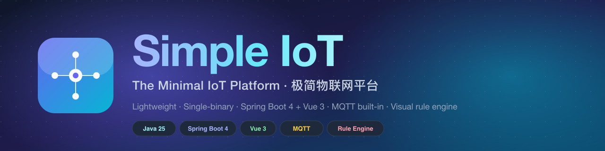

<div align="center">



# Simple IoT

**The Minimal IoT Platform — lightweight, single-binary, ready in 60 seconds.**

[](https://github.com/dingdaoyi/simple-iot/actions/workflows/ci.yml)
[](LICENSE)
[](https://openjdk.org/)
[](https://spring.io/projects/spring-boot)
[](https://vuejs.org/)
[](docker-compose.yml)
[](https://github.com/dingdaoyi/simple-iot/stargazers)

**English** · [简体中文](README.zh-CN.md) · [Live Demo](http://122.51.129.91) · [Documentation](https://dingdaoyi.github.io/simple-iot/) · [Report Bug](https://github.com/dingdaoyi/simple-iot/issues)

</div>

---

## ✨ Why Simple IoT?

Most IoT platforms are heavy, distributed, and overkill for small/mid-size deployments.
**Simple IoT** is the opposite: a single Spring Boot binary + a Vue 3 web app, **no Kafka, no Zookeeper, no microservice mess**. You can run the whole stack on a 2 GB VPS and connect thousands of devices in minutes.

| | Simple IoT | ThingsBoard CE | EMQX + custom UI |
|---|---|---|---|
| Architecture | Single binary | Multiple services | Broker + you build the rest |
| Memory footprint | ~ 512 MB | ~ 2 GB+ | ~ 1 GB + your stack |
| MQTT broker | Built-in (mica-mqtt) | Built-in | Yes (this is the only feature) |
| Visual rule engine | ✅ Drag-and-drop | ✅ | ❌ |
| Scriptable protocols | ✅ Java / JS / Groovy / Lua | Limited | ❌ |
| Time-series storage | InfluxDB 3 | Cassandra / Postgres | You pick |
| Modern UI | Minimal, Linear-style, dark mode | Material, dated | Build your own |
| One-command deploy | `./deploy.sh` | `docker-compose` (heavy) | DIY |
| Best fit | SMB, internal tools, edge gateways | Enterprise, multi-tenant SaaS | Pure messaging |

> **TL;DR** — if you want a real, production-grade IoT platform that you can actually self-host, read, fork and ship without becoming a distributed-systems expert, **Simple IoT** is for you.

---

## 🚀 Quick Start (60 seconds with Docker)

```bash
git clone https://github.com/dingdaoyi/simple-iot.git
cd simple-iot
chmod +x deploy.sh
./deploy.sh deploy
```

Then open:

| Service | URL | Default credentials |
|---------|-----|--------------------|
| Web UI | http://localhost | `admin` / `123456` |
| API docs | http://localhost:5010/iot/doc.html | — |
| MQTT broker | `mqtt://localhost:1883` | — |
| MQTT WebSocket | `ws://localhost:8083/mqtt` | — |

That's it. PostgreSQL, RustFS (S3-compatible), the backend and the frontend all spin up together.

> Want to develop locally? See the [development guide](#-development).

---

## 🎯 Core Features

| Module | What it does |
|--------|--------------|
| **Device Management** | Registration, online/offline tracking, batch operations, command dispatch |
| **Product & Thing Model** | Product types, properties, services, events — TSL inspired by Alink |
| **Protocol Engine** | Hot-loaded scripts in **Java / JavaScript / Groovy / Lua**, no restart needed |
| **Visual Rule Engine** | Drag-and-drop chain editor: input → filter → transform → action |
| **Alarm Center** | Severity levels (info / warning / critical / urgent), active / cleared lifecycle |
| **Data Ingestion** | InfluxDB 3 time-series storage, Caffeine in-process cache |
| **Notifications** | Email & SMS push, HTTP callbacks, MQTT forward, device commands |
| **Dashboard** | Device totals, online stats, system metrics (CPU / memory / disk), live alarms |
| **Auth & Permissions** | Sa-Token based, fine-grained, role/menu/button level |
| **Minimal UI** | Minimal, Linear-style design, light/dark/auto theme, responsive |

---

## 🖼️ Screenshots

<div align="center">

### Dashboard


### Visual Rule Engine


### Device Management


### Protocol Scripts


### Alarms


</div>

---

## 🏗️ Architecture

```
┌──────────────────────────────────────────────────────────────────┐
│                          Simple IoT                              │
├──────────────────────────────────────────────────────────────────┤
│                                                                  │
│   Vue 3 + Vite + Element Plus  (Minimal UI)                │
│           │                                                      │
│           ▼  REST / WebSocket                                    │
│   ┌──────────────────────────────────────────────────────────┐   │
│   │   Spring Boot 4 (single JVM, single binary)              │   │
│   │                                                          │   │
│   │   • Sa-Token auth         • MyBatis-Plus                 │   │
│   │   • Caffeine local cache  • Knife4j OpenAPI              │   │
│   │   • Visual rule engine    • Hot-loaded protocol scripts  │   │
│   │   • mica-mqtt broker (1883 / 8083 ws)                    │   │
│   └──────────────────────────────────────────────────────────┘   │
│           │                          │                           │
│           ▼                          ▼                           │
│   ┌──────────────┐          ┌────────────────┐                   │
│   │ PostgreSQL   │          │ InfluxDB 3     │                   │
│   │ (business)   │          │ (telemetry)    │                   │
│   └──────────────┘          └────────────────┘                   │
│                                                                  │
│   ┌──────────────────────────────────────────────────────────┐   │
│   │  Devices  →  MQTT / TCP / HTTP  →  Protocol scripts      │   │
│   └──────────────────────────────────────────────────────────┘   │
└──────────────────────────────────────────────────────────────────┘
```

### Stack

**Backend** — Java 25 · Spring Boot 4.0.2 · Sa-Token · MyBatis-Plus · PostgreSQL · InfluxDB 3 · mica-mqtt · Caffeine · Hutool · AWS S3 SDK
**Frontend** — Vue 3 · Vite · Element Plus · Pinia · Vue Router · Axios · ECharts
**Infra** — Docker Compose · RustFS (S3-compatible) · GitHub Actions

---

## 📦 Project Layout

```
simple-iot/
├── iot-server/         # Main Spring Boot service (REST + MQTT broker + rule engine)
├── iot-common/         # Shared base classes (BaseEntity, ResultCode, paging)
├── iot-driver/         # System-supplied protocol drivers
├── iot-web/            # Vue 3 admin frontend
├── doc/                # Docs, SQL schema, screenshots, brand assets
├── docker-compose.yml  # Stack: postgres + rustfs + iot-server + iot-web
├── deploy.sh           # One-command deploy / start / stop / logs
└── pom.xml             # Maven multi-module build
```

---

## 🛠️ Development

### Prerequisites
- JDK 25+
- Node.js 18+
- pnpm 8+
- PostgreSQL 14+
- Docker & Docker Compose (optional, recommended)

### Backend

```bash
# 1. Start PostgreSQL + RustFS only (skip backend/frontend)
docker compose up -d postgres rustfs

# 2. Run the server in your IDE / via Maven
cd iot-server
mvn spring-boot:run
```

API ready at `http://localhost:5010/iot/`, OpenAPI at `http://localhost:5010/iot/doc.html`.

### Frontend

```bash
cd iot-web
pnpm install
pnpm dev
```

Web ready at `http://localhost:5173`. Vite proxies `/iot` → `http://localhost:5010` automatically.

> See [`AGENTS.md`](AGENTS.md) for the full coding conventions used by this project (component patterns, design tokens, naming rules).

---

## 🗺️ Roadmap

- [ ] **v0.1** — Stable single-node release, English docs, Docker Hub images
- [ ] **v0.2** — i18n (English UI), thing-model import/export, device groups
- [ ] **v0.3** — Custom data dashboards (drag-and-drop widgets)
- [ ] **v0.4** — OTA upgrade flow, edge gateway packaging
- [ ] **v0.5** — Plugin system (protocol packs as standalone JARs)
- [ ] **v1.0** — Production hardening, performance benchmarks, helm chart

Open an issue or [Discussion](https://github.com/dingdaoyi/simple-iot/discussions) if there's a feature you want to see prioritised.

---

## 🤝 Contributing

Contributions are very welcome. Whether it's a typo fix, a new protocol script, a UI tweak, or a translation — every PR helps.

1. Read [CONTRIBUTING.md](CONTRIBUTING.md)
2. Fork → branch → commit (use [Conventional Commits](https://www.conventionalcommits.org/): `feat:`, `fix:`, `docs:`, ...)
3. Open a Pull Request

Found a bug or have a question? [Open an issue](https://github.com/dingdaoyi/simple-iot/issues/new/choose) or join the [Discussions](https://github.com/dingdaoyi/simple-iot/discussions).

---

## 🛡️ Security

If you discover a security vulnerability, please **do not** open a public issue. See [SECURITY.md](SECURITY.md) for the responsible-disclosure process.

---

## ⭐ Star History

<a href="https://star-history.com/#dingdaoyi/simple-iot&Date">
  
</a>

If this project helps you, please **drop a star ⭐** — it's the easiest way to support the work and helps others discover it.

---

## 📄 License

[Apache License 2.0](LICENSE) © dingdaoyi & contributors

---

<div align="center">

<sub>Built with ❤️ for makers, integrators and small teams who want IoT done right — without the complexity tax.</sub>

</div>
