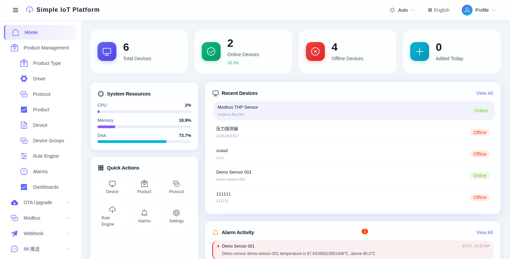
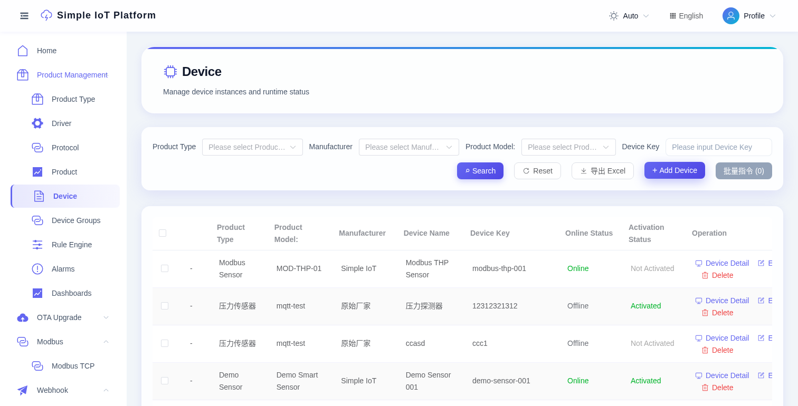
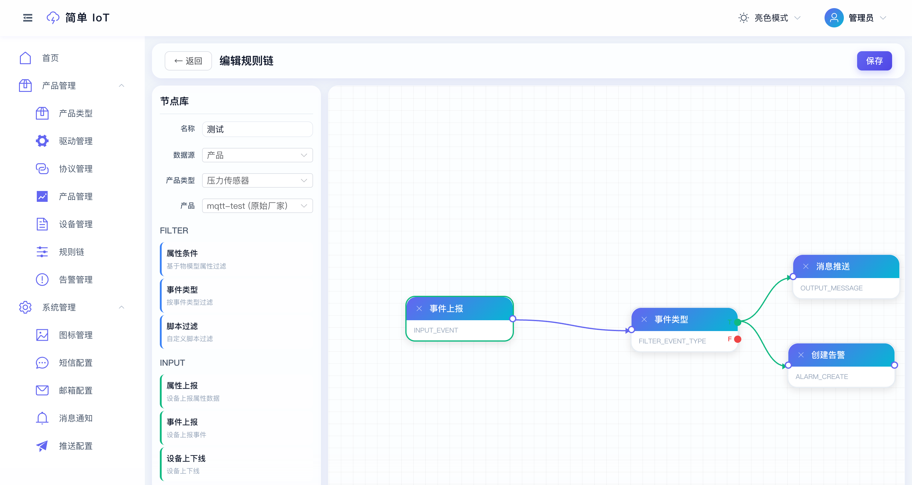

# 快速开始

本指南带你在 5 分钟内本地运行 **Simple IoT**。

## 前置条件

- Docker 24+ 及 Docker Compose v2
- 2 GB 可用内存
- 端口 `5010`、`1883`、`8083`、`9999`、`5432`、`8181` 可用

## 1. 克隆仓库

```bash
git clone https://github.com/dingdaoyi/simple-iot.git
cd simple-iot
```

## 2. 启动服务

```bash
cp .env.example .env       # 按需修改密码
./deploy.sh deploy
```

Docker Compose 会拉起完整技术栈：

| 服务 | 端口 | 用途 |
|---|---|---|
| `iot-server` | 5010 | Spring Boot REST + MQTT broker |
| `iot-web` | 80 | Vue 3 管理控制台 (Nginx) |
| `iot-postgres` | 5432 | PostgreSQL 16（业务数据） |
| `influxdb` | 8181 | InfluxDB 3（遥测数据） |
| `rustfs` | 9000 | S3 兼容存储 |
| `modbus-sim` | 5020 | Modbus 模拟器（演示用） |

## 3. 登录

打开 <http://localhost>，使用默认账号：

```
用户名: admin
密码: 123456
```

> **将系统暴露到公网前请先修改密码。**

登录后即可看到仪表盘——系统资源、快捷操作、最近设备、告警动态：



## 4. 体验实时数据

Docker 技术栈默认预置了演示传感器和 Modbus 模拟器。通过 MQTT 发布一条数据：

```bash
mosquitto_pub -h localhost -p 1883 \
  -i simple_demo-sensor-001 \
  -u demo-sensor-001 \
  -P demo-secret \
  -t simpleiot/pro/demo-smart-sensor \
  -m '{"temperature":72.5,"humidity":43,"voltage":220.8,"online":true,"mode":"auto"}'
```

数据会经过演示 JS 协议解析、入库，并触发预置的高温告警规则。
更多详情见 [MQTT 快速测试](./mqtt-test)。

Modbus 模拟器（`modbus-thp-001`）会自动轮询上报，无需手动操作即可在仪表盘看到数据。配置说明见 [Modbus TCP](./modbus)。

## 5. 接入第一台设备

1. 进入 **产品管理 -> 产品类型** -> 点击 **+ 新增**，定义一个产品类型。
2. 进入 **产品管理 -> 产品** -> 创建产品，选择 `MQTT` 协议，定义物模型属性（如 `temperature`、`humidity`）。
3. 进入 **产品管理 -> 设备** -> 在该产品下添加设备，记录 `deviceKey` 和 `secret`。
4. 用任意 MQTT 客户端连接 `tcp://<host>:1883`，`clientId=simple_{deviceKey}`，用户名=`{deviceKey}`，密码=`{设备密钥}`。
5. 在 **设备 -> 遥测** 页签查看实时数据流。



## 6. 创建规则

1. 进入 **产品管理 -> 规则引擎** -> **+ 新建规则链**。
2. 拖入一个 **Input** 节点，连接到 **Filter**，再连接到 **Action**。
3. Action 选择"发送邮件"/"MQTT 转发"/"设备指令"。
4. 保存并启用。



保存的那一刻规则就生效了。

## 7. 接收第三方数据（可选）

如果有第三方系统需要通过 HTTP 推送数据：

1. 进入 **Webhook -> Webhook Ingress** -> 创建配置，关联设备。
2. 复制自动生成的 `token` + `secret`。
3. 发送带签名的 POST 请求——完整 curl 示例见 [Webhook 接入](./webhook-ingress)。

## 本地开发

如果想改代码而不是跑预构建镜像，参见 [架构总览](./architecture) 页面的开发模式工作流（Maven + pnpm）。
