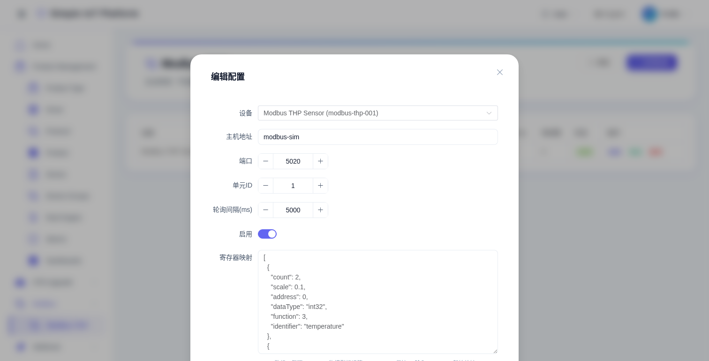

# Modbus TCP 驱动

Simple IoT 内置 Modbus TCP 轮询驱动，支持按设备定时读取寄存器并自动上报为遥测数据。


## 工作原理

平台作为 Modbus Master，按配置的间隔定时连接从站设备，读取寄存器值并映射为物模型属性，通过 `messageUp` 进入标准数据管道（InfluxDB 持久化 + 规则链 + WebSocket 推送）。

## 创建配置

1. 进入 **Modbus -> Modbus TCP** 页面，点击 **新增配置**。
2. 选择关联设备（设备需已创建并关联了物模型属性）。
3. 填写从站连接信息（Host、Port、Unit ID）。
4. 填写寄存器映射 JSON（见下方说明）。
5. 设置轮询间隔，保存即可。



## 配置字段说明

| 字段 | 说明 | 示例 |
|---|---|---|
| 设备 | 关联平台中的设备 | `Modbus THP Sensor` |
| Host | Modbus 从站 IP | `modbus-sim` 或 `192.168.1.100` |
| Port | Modbus TCP 端口 | `502`（标准），`5020`（demo） |
| Unit ID | Modbus 从站地址 | `1` |
| 轮询间隔(ms) | 多久读一次，默认 5000 | `5000` |
| 寄存器映射 | JSON 数组，定义读取哪些寄存器 | 见下方 |
| 启用 | 是否启用轮询 | `true` |

## 寄存器映射详解

寄存器映射是一个 JSON 数组，每项定义"读哪个寄存器、怎么读、映射到哪个属性"：

```json
[
  {
    "identifier": "temperature",
    "function": 3,
    "address": 0,
    "count": 2,
    "dataType": "DOUBLE",
    "scale": 0.01
  }
]
```

### 字段逐项说明

| 字段 | 类型 | 必填 | 说明 |
|---|---|---|---|
| `identifier` | string | 是 | 物模型属性标识符，必须与设备物模型中定义的属性 ID 一致 |
| `function` | int | 是 | Modbus 功能码，见下表 |
| `address` | int | 是 | 起始寄存器地址（0-based） |
| `count` | int | 是 | 读取的寄存器数量（1 寄存器 = 16 bit = 2 字节） |
| `dataType` | string | 是 | 数据类型：`BOOL` / `INT` / `FLOAT` / `DOUBLE` |
| `scale` | double | 否 | 缩放系数，最终值 = 原始值 × scale，默认 1.0 |

### 功能码对照

| function | 读/写 | 寄存器类型 | 数据范围 |
|---|---|---|---|
| 1 | 读 | 线圈（Coil） | 0 或 1 |
| 2 | 读 | 离散输入（Discrete Input） | 0 或 1 |
| 3 | 读 | 保持寄存器（Holding Register） | 0-65535 |
| 4 | 读 | 输入寄存器（Input Register） | 0-65535 |

### 数据类型与寄存器数量

| dataType | 字节 | 寄存器数(count) | 说明 |
|---|---|---|---|
| `BOOL` | 1 | 1 | 通常配合 function=1 读线圈 |
| `INT` | 2-4 | 1-2 | 16位用 count=1，32位用 count=2 |
| `FLOAT` | 4 | 2 | IEEE 754 单精度浮点 |
| `DOUBLE` | 8 | 4 | IEEE 754 双精度浮点 |

### scale 缩放说明

很多 Modbus 设备返回整数，需要乘以系数才是真实物理值。例如温度传感器返回 `2040`，实际温度 `20.4°C`，则 `scale = 0.01`。

**注意**：`scale != 1.0` 时，系统自动将数据类型提升为 `DOUBLE`。

## 完整示例

一个温湿度压力传感器 + 开关量，4 个属性：

```json
[
  {
    "identifier": "temperature",
    "function": 3,
    "address": 0,
    "count": 2,
    "dataType": "DOUBLE",
    "scale": 0.01
  },
  {
    "identifier": "humidity",
    "function": 3,
    "address": 2,
    "count": 1,
    "dataType": "INT"
  },
  {
    "identifier": "pressure",
    "function": 3,
    "address": 4,
    "count": 2,
    "dataType": "DOUBLE",
    "scale": 0.1
  },
  {
    "identifier": "switch",
    "function": 1,
    "address": 100,
    "count": 1,
    "dataType": "BOOL"
  }
]
```

含义：
- 保持寄存器 0-1 → temperature（DOUBLE, ÷100）
- 保持寄存器 2 → humidity（INT）
- 保持寄存器 4-5 → pressure（DOUBLE, ÷10）
- 线圈 100 → switch（BOOL）

## Demo 模拟器

Docker Compose 包含 `modbus-sim` 容器，预置了上面的配置：

| 项目 | 值 |
|---|---|
| 容器名 | `modbus-sim` |
| 端口 | `5020`（容器内 502，映射到 5020） |
| Unit ID | `1` |
| 设备 | `modbus-thp-001` |

部署后即可在仪表盘和设备详情页看到实时数据：temperature ≈ 20°C，humidity ≈ 60%，pressure ≈ 101kPa。

## 测试与排错

- **测试按钮**：配置列表中点"测试"会立即触发一次轮询，观察日志确认连通性。
- **设备不在线**：检查 Host/Port 是否可达，Unit ID 是否正确。
- **数据为空**：检查 `identifier` 是否与物模型属性 ID 完全一致。
- **值不对**：检查 `scale` 系数和 `dataType`，32位整数需要 `count=2`。
- **频繁超时**：增大轮询间隔，或检查网络质量。
