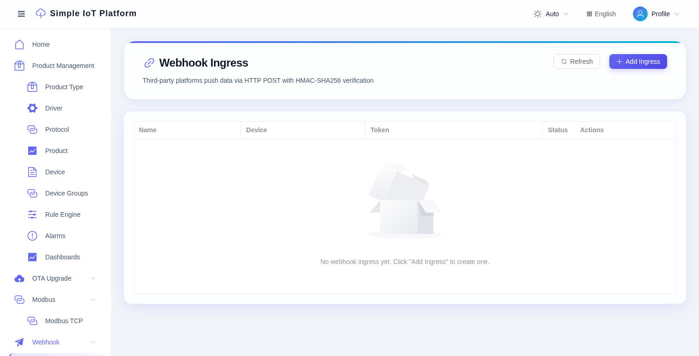

# Webhook 数据接入

Simple IoT 支持通过 HTTP Webhook 接收第三方平台（ERP、MES、天气 API 等）推送的遥测数据，使用 HMAC-SHA256 签名验证。



## 工作原理

1. 在控制台创建 Webhook 接入，关联一个设备，系统生成唯一的 `token` + `secret`。
2. 第三方系统带 HMAC 签名头 `POST` JSON 到 `/iot/webhook/{token}`。
3. 服务端验签后将 JSON 每个键值对映射为设备属性，写入 InfluxDB。

## 创建接入

1. 进入 **Webhook -> Webhook Ingress** 页面，点击 **Add Ingress**。
2. 填写名称、选择关联设备、保存。
3. 系统自动生成 `token` 和 `secret`，弹窗展示端点 URL、签名算法和 curl 示例。
4. 复制 token 和 secret 给第三方系统使用。

## 签名算法

```
signature = HMAC-SHA256(secret, timestamp + "." + body)
```

请求头：

| Header | 说明 |
|---|---|
| `X-Siot-Timestamp` | Unix 毫秒时间戳（与服务端时间差不超过 5 分钟） |
| `X-Siot-Signature` | HMAC-SHA256 的十六进制字符串 |

## curl 示例

```bash
TOKEN="your-webhook-token"
SECRET="your-webhook-secret"
BODY='{"temperature":25.5,"humidity":60}'
TS=$(date +%s%3N)
SIG=$(printf '%s.%s' "$TS" "$BODY" | openssl dgst -sha256 -hmac "$SECRET" | awk '{print $NF}')

curl -X POST "http://localhost:5010/iot/webhook/$TOKEN" \
  -H "Content-Type: application/json" \
  -H "X-Siot-Timestamp: $TS" \
  -H "X-Siot-Signature: $SIG" \
  -d "$BODY"
```

## 请求格式

Body 是裸 JSON，每个顶层 key 对应物模型中定义的属性标识符：

```json
{
  "temperature": 25.5,
  "humidity": 60
}
```

服务端将每个键值对包装成标准协议格式，走正常的 `messageUp` 管道，规则链、InfluxDB 持久化、WebSocket 推送全部自动生效。

## 错误响应

| Code | Message | 原因 |
|---|---|---|
| 401 | `签名验证失败` | 签名错误或缺少请求头 |
| 401 | `时间戳过期` | 时间戳超出 5 分钟窗口 |
| 404 | `webhook不存在` | token 无效 |
| 500 | `设备未连接` | 设备离线（webhook 需要在线设备） |

## 管理操作

- **重新生成密钥**：点击列表中的"重新生成"会产出新的 token + secret，旧密钥立即失效。
- **启用/禁用**：禁用后该 token 不再接受请求。
- **接入说明**：创建或重新生成密钥后，弹窗中的 curl 命令已填入实际 token 和 secret，可直接复制使用。
